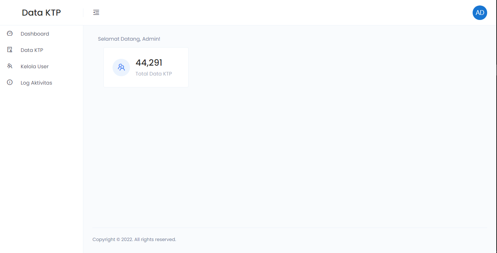
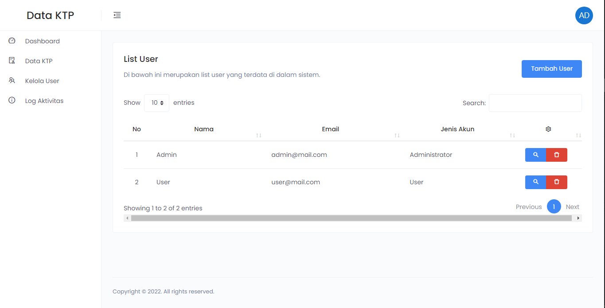
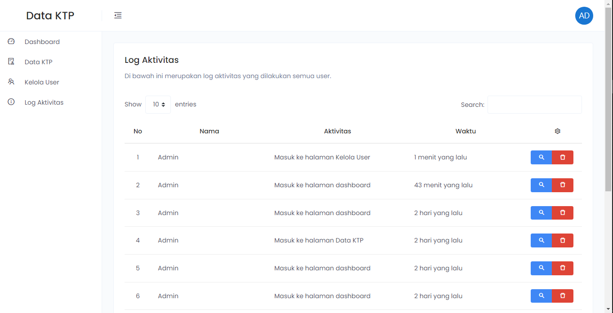

# Aplikasi Data KTP

Aplikasi ini dibuat untuk memenuhi persyaratan pendaftaran sebagai Web Developer di PT. Patigeni Mitra Sejati.
<br>

## Screenshot





## Installation
1. Install application
```
composer install
```

2. Create .env file
3. Migrate table to database
```
php artisan migrate
```

4. Create account to login
```
php artisan db:seed --class=CreateUserSeeder
```

5. Login to application
```
email: admin@mail.com
password: 123456
```
```
email: user@mail.com
password: 123456
```
6. Import 40.000 data sql from file data.sql in folder database

## License

The Laravel framework is open-sourced software licensed under the [MIT license](https://opensource.org/licenses/MIT).
